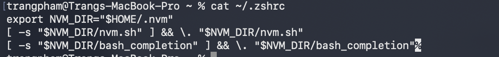

# Playwright

## Setup

NodeJS

VSCode

GitHub

Git

***Prospects***

- Cross browser: Firefox, Chrome,..
- Cross platform: Linux, MacOS, Win
- Auto waiting: wait until element visible
- Report: Passed/ Failed, fail in which row?, time
- Code gen ~ Recording in Katalon
- Easy to setup
- Framework supports a lot

**Setup Playwright**

1. Open terminal

    ```jsx
    npm init playwright@latest
    ```

# NodeJS

**Node.js:** env to run js out of browser

```
💡 In the past, js only runs in browser 

F12 → console.log("Hello");

```

**NVM (Node Version Manager):** use to manage Node.Js version

- Project A: Node 18

- Project B: Node 22

Node only 1 version
Use nvm → Can change nvm

```jsx
nvm install 18
nvm install 22

nvm use 18
```

Q: when updating version, package.js file will update ?

1. **Install nvm**

    ```jsx
    brew install nvm
    ```

    If have not installed Homebrew yet

    ```jsx
    /bin/bash -c "$(curl -fsSL
    https://raw.githubusercontent.com/Homebrew/install/master/install.sh)"
    ```


2. **Set nvm bash**

    ```
    source $(brew --prefix nvm)/nvm.sh
    ```

3. **Check version**

    ```jsx
    nvm --version
    ```

4. **Install NodeJS**

    ```jsx
    nvm install --lts
    ```

5. **Check NodeJS version**

    ```jsx
    node --version
    ```

Fix issue cannot use npm in VS terminal

1. Check app in .zprofile

    ```jsx
    cat ~/.zshrc
    ```

2. Add nvm into .zprofile

    ```jsx
    export NVM_DIR="$HOME/.nvm"
    [ -s "$NVM_DIR/nvm.sh" ] && \. "$NVM_DIR/nvm.sh"
    [ -s "$NVM_DIR/bash_completion" ] && \. "$NVM_DIR/bash_completion"
    ```

3. Check again in  VSCode

    ```jsx
    source ~/.zshrc
    node -v
    npm -v
    nvm current
    ```

4. Check `cat ~/.zshrc`
    
    
    
# Git

<aside>
💡

Supports user manage the version control system

</aside>

## Three states

1. `git init`  creates 3 stages — files ready to use git
2. The files are in **Working Directory**
3. `git add` transfers files into **Staging Area**
4. `git commit -m "<>"` creates a new version into **Repository** as a commit

<aside>
✏️

Key words

- Working Directory: draft files
- Staging Area: prepared area
- Repository: contains commits (versions)
</aside>

## **Config user**

```jsx
git config --global user.name "Trang Pham"
git config --global user.email "trangptt315@gmail.com"
git config --global init.defaultBranch main
git config --list
```

Tell git who you are

## **A. Push new code into new empty repo**

1. Copy URL of repo in Github
2. Create repo local ( for using git )
    
    ```jsx
    git init
    ```
    
3. Link repo Github and repo local
    
    ```jsx
    git remote add origin <URL>
    ```
    
4. Add new updates
5. Commit
6. Push code to Github repo
    
    ```jsx
    git push origin main
    ```

# GitHub

SSH key

2 files

- .**id_rsa**: on local - private
- **.id_rsa_pub**: on Git Hub - pub

When we want to commit code “a” on Github, **.id_rsa** will sign on the “a” then .**id_rsa_pub** will check is that the matching **.id_rsa**  on the local or not

1. **How to gen SSH Keys**

```jsx
ssh-keygen -t rsa -b 4096 -C "<your-email>"
```

**Get the content**

```jsx
cat ~/.ssh/id_rsa.pub
```

**Check git version**

```jsx
git --version
```