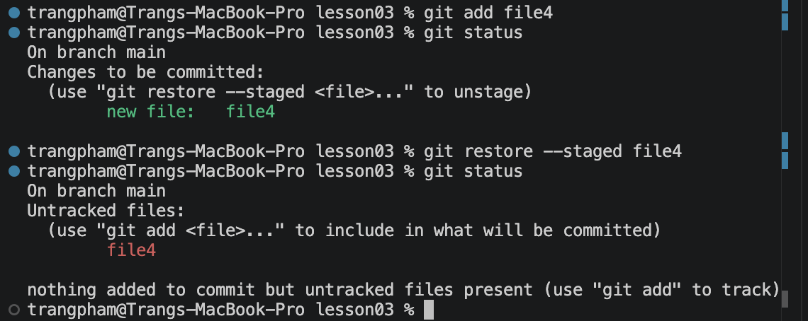
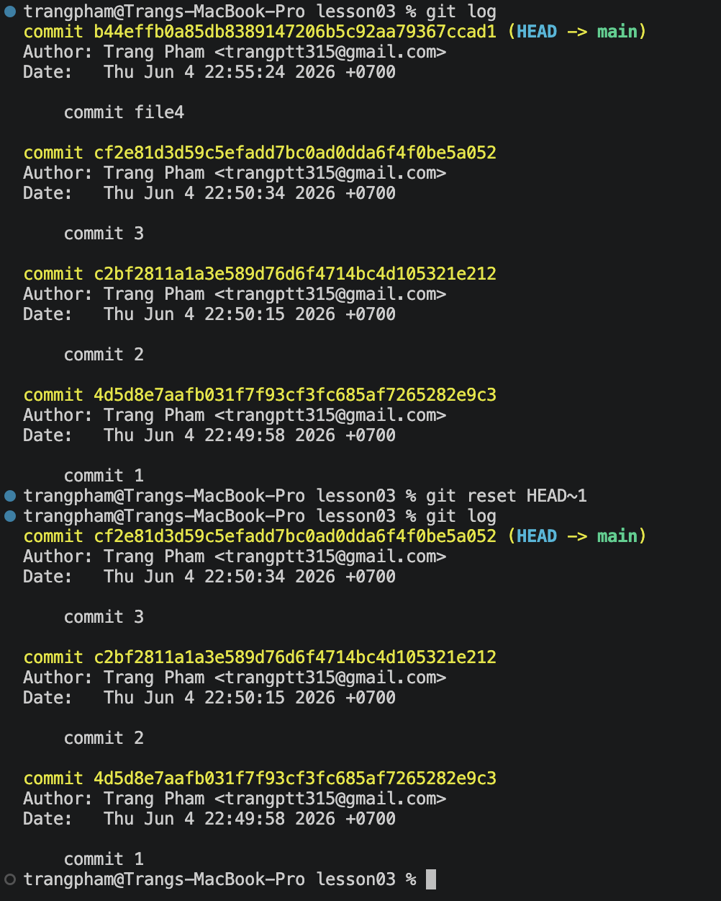
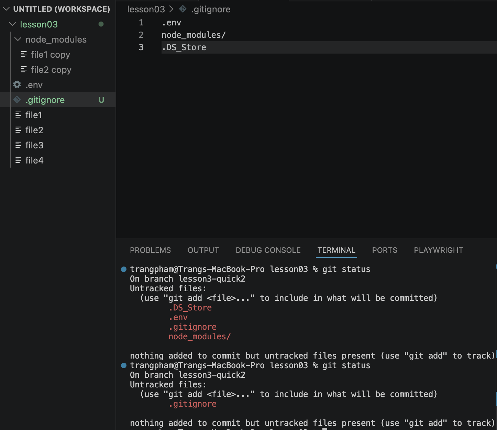

# Lesson 3
# GIT
## C. Undo commit

### 1. Undo from Staging to Working directory

Restore a specific file

```jsx
git restore --staged <file_name>
```


Restore all files

```jsx
git restore --staged .
```

### 2. Undo from Repository to Working directory

Reset a specific commit 

```jsx
git reset HEAD~<OrderOfCommit>
```



## Branch

### 1. Create a new branch

```jsx
git branch <branch_name>
```

### 2. Switch to a branch

```jsx
git checkout <branch_name>
```

Note: 
If the file is in Working Directory, we will see the file in all branches.
But one branch commit the file on their own branch, the file will be disappeared from all branches

### 3. Create and switch to new branch

```jsx
git checkout -b <branch_name>
```

### 4. Delete a brach

```jsx
git branch -D <branch_name>
```

# Git Amend

`git amend` is used to update the latest commit.

---

## 1. Edit the commit message

Update only the latest commit message.

```bash
git commit --amend -m "<message>"
```

Or open the editor and edit the message directly:

```bash
git commit --amend
```

### Vim commands

- Press `i` to enter **INSERT** mode.
- Edit the commit message.
- Press `Esc`.
- Type `:wq` and press `Enter` to save and quit.

---

## 2. Add files to the latest commit

Add a forgotten file to the latest commit while keeping the existing commit message.

```bash
git add <file>
git commit --amend --no-edit
```

---

## 3. Add files and update the commit message

Add files and modify the commit message at the same time.

```bash
git add <file>
git commit --amend -m "<message>"
```

---

## 4. Remove files from the latest commit

Remove a file from the latest commit and keep the existing commit message.

```bash
git reset HEAD~ -- <file>
git commit --amend --no-edit
```

> Note: This removes the file from the commit but keeps the file in your working directory.

---

## .gitignore

Use to ignore the unnecessary files



# JavaScript

## Convention

### 1. snake_case

```jsx
your_name
```

### 2. kebab-case

Set **file** and **folder** name

```jsx
your-name
```

### 3. camelCase

Set **var** and **function** name

```jsx
yourName
```

### 4. PascalCase

Set **class name**

```jsx
YourName
```

### 5. UPPER_CASE

```jsx
YOUR_NAME
```

## Console log

```
let myName = "Anna";
console.log(`Toi la ${myName}`);
console.log('Toi la ' + myName + '.')
```

Return

```jsx
Toi la Anna
Toi la Anna.
```

## Object

Object combines multiple variables

```jsx
const myInfo = {
    name: "Anna",
    age: 19,
    "my address 1": "HCM",
    'my address 2': "Long An",
    isLoveCode: true,
    codingClass:{
        name: "Playwright",
        level: "Beginner"
    }
};

console.log(myInfo);
```

Return

```jsx
{
  name: 'Anna',
  age: 19,
  'my address 1': 'HCM',
  'my address 2': 'Long An',
  isLoveCode: true,
  codingClass: { name: 'Playwright', level: 'Beginner' }
}
```

### 1. Key

`'my address 2'` is a key

### 2. Value

`Long An` is a value

Value can set as a string/ number/ boolean/ another object

### 3. Return value of an object

```jsx
console.log(myInfo.name);
console.log(myInfo.codingClass);
console.log(myInfo.codingClass.name);
console.log(myInfo["my address 2"]["city"]);
// Contains spaces
```

Return

```jsx
Anna
{ name: 'Playwright', level: 'Beginner' }
Playwright
Long An
```

### 4. Object and Constant

As we know, we get an error when trying to reassign a `const` variable.

The same rule applies to objects: we cannot reassign the object itself.

However, we can still update the object's properties.

For example, we can update a key's value:

```jsx
const person = {
  name: "meo",
  age: 28
};

// Update a property
person.age = 29;

// Add a new property
person.city = "HCM";

// Delete a property
delete person.age;
```

But reassigning the object will cause an error:

```jsx

const person = {

  name: "Meo"

};

person = {

  name: "John"

}; // Error
```

**Note: Only the object reference is constant, not its properties.**

## Array

```jsx
const arr = [2, 3, 4, 9, 10];
```

### 1. Get number of elements of an array

```jsx
console.log(arr.length);
```

### 2. Get value of an element

```jsx
console.log(arr[3]);
```

Return 

```jsx
9
```

Note:
The order of array starts from 0

```jsx
console.log(arr[0]);
```

Return

``` 
2
```

### 3. Add element into array

```jsx
const arr = [1, 2];
arr.push(3);

console.log(arr);
```

Return

```
[1, 2, 3]
```

## Function

Create a function to use it many times with other variables

```jsx
function calArea(length, width) {
    const area = length * width;
    return area;
}

console.log(`Area of rectangle ${calArea(5, 12)}`);
```