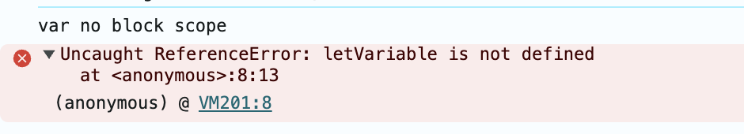
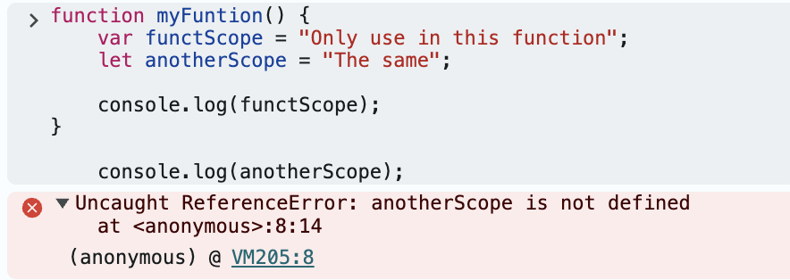
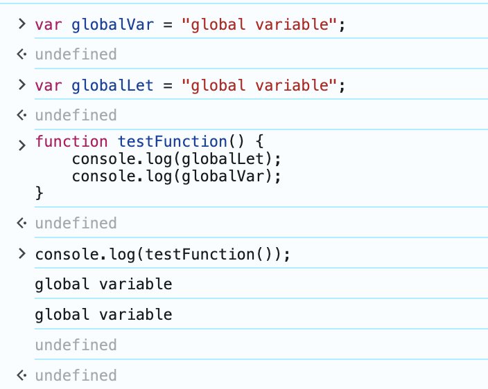

# JavaScript Continue
## Variables

### Block scope

var: unlimited in {}

let/ const: limited in {}

```jsx
if (true) {
var varVariable = "var no block scope";
let letVariable = "let block scope";
const constVariable = "const block scope";
}

console.log(varVariable);
console.log(letVariable);
console.log(constVariable);
```

Return



---

### Function scope

var, let, const: only use these var in the function

```jsx
function myFuntion() {
    var functScope = "Only use in this function";
    let anotherScope = "The same";
    
    console.log(functScope);
}

    console.log(anotherScope);
```

Return



---

### Global

var declare not in block or function


---
## Conditions

### If-condition

#### If - Else

```jsx
let score = 70;
if (score >= 90) {
	console.log("Outstanding");
} else if (score >= 80) {
	console.log("Very Good");
} else if (score >= 70) { 
	console.log("Good");
} else if (score >= 60) { 
	console.log("Average");
} else {
	console.log("Weak");
}
```

Return

```jsx
Good
```

#### Ternary operator

- A shorthand version of the `if...else` statement.
- Used for simple conditional expressions.

Syntax:

condition ? expressionIfTrue : expressionIfFalse;

```jsx
let grade = 
score >= 90 ? "Outstanding" :
score >= 80 ? "Very Good" :
score >= 70 ? "Good" :
score >= 60 ? "Average" : "Weak"

console.log(grade);
```

---

### For-condition

#### For .. in

```jsx
const person = {
	name: "John",
	age: 34,
	city: "Hanoi"
};

for (let key in person) {
	console.log(key)
}
```

Return

```jsx
name
age
city
```

#### forEeach

```jsx
const numbers = [1, 3, 4, 6];
numbers.forEach(function(value) {
	console.log(value);
});
```

Return

```jsx
1
3
4
6
```

---

## Break and Continue

### Break

Can break the loop immediately when match the condition

```jsx
const numbers = [1, 3, 8, 9,12];
let firstEnven = null;

for (let i = 0; i < numbers.length; i++){
    if (numbers[i] % 2 === 0) 
    {
        firstEnven = numbers[i];
        break;
    }
}
 console.log(`${firstEnven} is a first even number`);
```

Return

```jsx
8 is the first even number
```

---

### Continue

Ignore below code in the working loop, continue next loop

```jsx
const numbers = [1, 3, 8, 9, 12];

for (let num of numbers) {

    if (num % 2 != 0) {

        oddArr.push(num);
    }
}
console.log(oddArr);
```

Return

```jsx
oddArr = [1, 3, 9];
```

---

## String Utils

### trim()

Trim the “Start” and “End”

```jsx
let text = "   No problem   ";
console.log(text.trim()); // trim the space in the begin and end
console.log(text.trimStart());
console.log(text.trimEnd());

```

---

### toUpperCase and toLowerCase

```jsx
let str = "JavaScript";
console.log(str.toUpperCase());
console.log(str.toLowerCase());

```

Return

```jsx
JAVASCRIPT
javascript
```

---

### includes

Check including string 

```jsx
let text = "Automation testing";
console.log(text.includes("Automation"));
console.log(text.includes("automation"));
console.log(text.includes("Auto"));
```

Return

```jsx
true
false
true
```

---


### split

Split str by the seperator
`text.split("<seperator>"))`

```jsx
let text = "Automation testing";
console.log(text.split(" "));
```

Return

```jsx
[ 'Automation', 'testing' ]
```

---

### replace

replace str
`replace(”<need to replace>”, “<replaced text>”)`

```jsx
let text = "I am in Ho Chi Minh"
console.log(text.replace("Ho Chi Minh", "Ha Noi"));
```

Return

```jsx
I am in Ha Noi
```

---
## Array Utils

### Add  element at the end

`push()`

```jsx
let arr = [1, 2, 3];
arr.push(4);
console.log(arr);
```

Return

```jsx
[ 1, 2, 3, 4 ]
```

---


### Add an element from the beginning

`unshift`()

```jsx
let arr = [1, 2, 3];
arr.unshift(0);
console.log(arr);
```

Return

```jsx
[0, 1, 2, 3]
```

---


### Add an element in the middle

`splice(<order>, 0, <element>)`

```jsx
let arr = [1, 2, 3];

arr.splice(2, 0, 1.5);
console.log(arr);
```

Return

```jsx
[ 1, 2, 1.5, 3 ]
```

---


### Delete an element at the end

`pop()`

```jsx
let arr = [1, 2, 3];
arr.pop();
console.log(arr);
```

Return

```jsx
[ 1, 2]
```

---


### Delete an element from the beginning

`shift`()

```jsx
let arr = [1, 2, 3];
arr.shift();
console.log(arr);
```

Return

```jsx
[2, 3]
```

---


### Delete an element from the middle

`splice(<order>, <numberOfElement>)` 

delete <numbersOfElements> from <order>

```jsx
let arr = [1, 2, 3, 4, 5];

arr.splice(1, 2);

console.log(arr);
```

Return

```jsx
[1, 4, 5]
```

---


### Find an element

Find the first element matching the condition

`find(num => num <condition>)` 

```jsx
let arr = [1, 2, 3, 14, 5];

let first = arr.find(num => num > 10)
console.log(first);
```

Return

```jsx
14
```

---


### Filter all elements

Filter all elements matching the condition

`filter(num => num <condition>)` 

```jsx
let arr = [1, 2, 3, 14, 5];

let allEle = arr.filter(num => num < 10)
console.log(allEle);
```

Return

```jsx
[ 1, 2, 3, 5 ]
```

---


### Map array

Create a new array based on the old array
Influence on each element and not change the length of array

`map(num => num <action>)` 

```jsx
let arr = [1, 2, 3, 14, 5];

let eachEle = arr.map(num => num + 2);
console.log(eachEle);
```

Return

```jsx
[ 3, 4, 5, 16, 7 ]
```

---


### Sort array

Sort elements in array

`a-b` ASC

`b-a` DESC

`sort((a, b) => a - b)` 

ASC

```jsx
let arr = [9, 50, 3, 14, 5];

let sortASC = arr.sort((a, b) => a - b);
console.log(sortASC);
```

Return

```jsx
[ 3, 5, 9, 14, 50 ]
```

DESC

```jsx
let arr = [9, 50, 3, 14, 5];

let sortDESC = arr.sort((a, b) => b - a);
console.log(sortDESC);
```

Return

```jsx
[ 50, 14, 9, 5, 3 ]